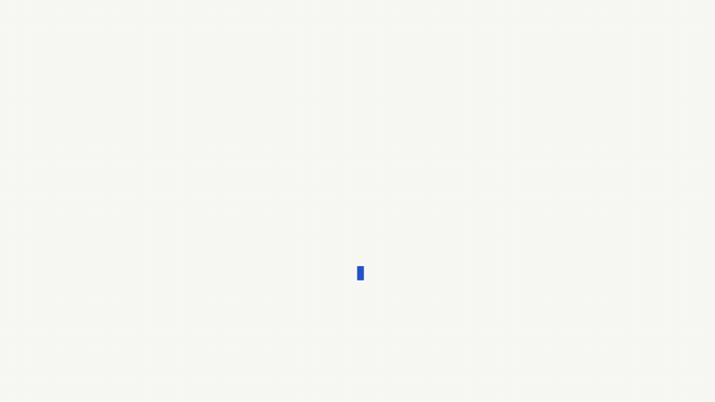

# Case: persistent computers for AI agents

Case gives AI agents a durable Linux desktop (Chromium, files, logins) on any machine
with Docker. Sleep, wake, or reboot: the identity stays on the volume. You bring the
brain (Claude, Cursor, Codex, or the Drive UI with your provider key).



What the agent gets, over MCP:

- **A real desktop**: navigate, snapshot numbered clickable elements, click/fill
  by ref, hover menus, upload files under `/home/agent`, marked screenshots,
  exec, files, network capture — no coordinate guessing. Navigate and click
  return the first 2000 characters of page text.
- **Vault logins**: the human saves a credential once (encrypted, via a one-time
  link); the machine types it into the site's own login page. The agent and the
  API never see the password.
- **Human handoff**: 2FA codes, captchas and approvals pause the run and reach a
  human — in Drive, on their phone over Telegram (Approve / Deny buttons, reply
  with the code), or via a one-shot Assist link (ntfy).
- **Skills**: the agent saves a completed task as a SKILL.md on the computer and
  follows it next run. Procedural memory that survives reboots.
- **Schedules**: recurring headless runs on the computer's own identity.

```
Drive UI (4174) ──┐
agent / MCP (8788)┼─→ cased (8787: REST, vault, lifecycle) ─→ deskd (in-container:
bin/case ─────────┘                                            display, input, Chromium)
```

## Quick start

Needs Docker 20.10+ with Compose v2.

1. Clone the repo.

```bash
git clone https://github.com/case-computers/case.git && cd case
```

2. Start the stack.

```bash
docker compose up --build
```

3. Open http://127.0.0.1:4174/deploy in your browser to create a computer.

4. Default MCP URL (compose): http://127.0.0.1:8788/mcp

   Point Claude Code at it (use `127.0.0.1`, not `localhost`: the SDK 421s on a
   Host mismatch).

```bash
claude mcp add --transport http case http://127.0.0.1:8788/mcp
```

## Faster start

Skip the desktop image build (Debian + Xfce + Chromium, a few minutes) by
pulling a published image:

```bash
docker pull ghcr.io/case-computers/case-desk:latest
echo "CASE_IMAGE=ghcr.io/case-computers/case-desk:latest" >> .env
docker compose up
```

If that pull 404s, no image has been published yet. Use `docker compose up --build`.

## Optional

### API-only mode

Run the control plane and MCP without the Drive UI.

```bash
docker compose up cased mcp --build
```

### Cursor config

```json
{ "mcpServers": { "case": { "type": "http", "url": "http://127.0.0.1:8788/mcp" } } }
```

`case-mcp.json` at the repo root is the stdio MCP config the scheduler passes
to Claude (`--mcp-config`). Compose users should use the HTTP URL above.

### Laptop without Compose

Run the control plane on the host (needs a venv with `requirements.txt`), then
Drive locally:

```bash
bin/case up
CASE_LOCAL=1 CASE_URL=http://127.0.0.1:8787 node web/web-ui/serve.mjs
```

Drive stores thread screenshots under `~/.case/drive/shots` and chat
attachments under `~/.case/drive/inbox` (Compose: the `ui-data` volume via
`CASE_HOME=/data`). Those files persist after a thread is deleted — remove
the directory or volume if you need them gone. `CASE_TURN_TOKENS` (default 2M)
caps one turn's cumulative input tokens. Mid-turn messages go to
`/api/chat/steer`. Attach files from the plus menu; they stay on the Drive
host and are never copied onto the computer.

### More knobs

Phone chat (Telegram or ntfy), CAPTCHA auto-solve, scheduled runs: all
optional, all documented in [.env.example](.env.example).

### Phone chat (optional)

Drive can take tasks from your phone. Off by default. Nothing gets exposed:
Drive dials out and posts replies back. Phone messages run through the same
brain and `threads.json` as the laptop UI, in a thread named `Phone`. Both
channels need a box-side key, since there is no browser to hold one:

```
CASE_DRIVE_PROVIDER=openai              # or anthropic
CASE_DRIVE_API_KEY=
```

A pending handoff (2FA code, approval) consumes the next phone message. With
several open, prefix the answer with the handoff id: `h_ab12 483920`.
`approve`, `deny`, `done`, or a bare code with nothing waiting gets back
"Nothing waiting." Text sent while a Phone turn is running steers that turn;
otherwise it starts a task on the box's first computer.

This is a live channel, not a queue. Telegram holds messages for a Drive that
is down and reports the ones older than ten minutes back as skipped; ntfy
drops them, so send again.

#### Telegram

1. In Telegram, open [@BotFather](https://t.me/BotFather), send `/newbot`,
   pick any name, and copy the token it gives you. Keep the bot private:
   `/setjoingroups` → Disable.
2. Put the token in `.env` and start the UI:

```
CASE_TELEGRAM_TOKEN=123456:ABC…
```

```bash
docker compose up -d ui
```

3. Send `/start` to your bot. It answers with your chat id and the line to
   add. Add it to `.env` and restart the UI:

```
CASE_TELEGRAM_CHAT_ID=123456789
```

```bash
docker compose up -d ui
```

4. Send a task: `what is on the screen?`. The bot shows "typing" while it
   works and posts the result (or the error), split at Telegram's message
   limit.

Only your chat can drive the box; every other chat is ignored. Approval
handoffs arrive with Approve / Deny buttons; code handoffs arrive as a prompt
you reply to. Restarting the UI never loses a pending handoff: it is sent
again on reconnect.

#### ntfy

[ntfy](https://ntfy.sh) is a pub-sub service. The public server has no
accounts: a topic is just a name, and anyone who knows the name can post and
read. The topic name is your only credential, so mint a long random one and
treat it like a password:

```bash
openssl rand -hex 32
```

1. Install the ntfy app (Play Store / App Store) and subscribe to that topic.
   Self-hosting ntfy instead? Point the app and `CASE_NTFY_URL` at your
   server; `CASE_NTFY_TOKEN` carries the bearer token if your server uses
   ntfy access control.
2. Configure the box (`.env`) and restart the UI container:

```
CASE_NTFY_CHAT=1
CASE_NTFY_URL=https://ntfy.sh          # or your ntfy server
CASE_NTFY_TOPIC=<the value from openssl>
CASE_NTFY_TOKEN=                        # self-hosted ntfy auth only
```

```bash
docker compose up -d ui
```

3. Send a message.
   - Android: the ntfy app has a message bar at the bottom of the topic view
     (Settings > Show message bar if it's hidden).
   - iOS: the app only receives. Make a Shortcut: Ask for Input, then Get
     Contents of URL with method POST, the input as the request body, and
     `https://ntfy.sh/<topic>` as the URL. Add it to the home screen or run
     it with Siri.
   - Any machine: `curl -d "check my mail" ntfy.sh/<topic>`. Useful to test
     the bridge before involving the phone.

Drive posts `Working`, then the final text or the error, back to the same
topic. Its own posts are tagged so it never reads them back as instructions.

### Token hardening (optional)

Copy `.env.example` to `.env`, generate a token, and set `CASE_TOKEN` before
exposing ports off loopback.

```bash
cp .env.example .env
openssl rand -hex 32
```

### Stop everything

```bash
docker compose down
```

## Details

### Separate database warning

`bin/case up` runs the control plane on the host with its database in `~/.case`.
Compose uses a Docker volume instead. Same engine, same desktops, two separate
databases: computers you create one way are not listed by the other, and both
want port 8787, so run one at a time.

### RAM budget

Pick each computer's size when you create it (`+ New computer` → SIZE, default 2 GB and
1 CPU). The sizing sticks to the computer and is reapplied every time its container is
rebuilt, so a box you made big stays big.

Two limits keep a host from being oversold:

- `CASE_MAX_RUNNING`: how many computers may be awake at once (compose default `4`).
- `CASE_MAX_RAM_MB`: how much memory those awake computers may hold in total.
  Unset means 75% of what the Docker engine reports, so it is usually right without
  being set. A create or wake that would exceed it returns `409`, which is the polite
  version of the OOM killer.

Asleep computers cost disk only, and disk is not capped: Docker's local volume driver
has no size limit, so Case does not pretend to offer one.

On macOS the number that matters is the VM's RAM, not the Mac's. Colima defaults to
4 GB, which is one 2 GB computer plus headroom. `colima start --cpu 4 --memory 8` if you
want more.

A laptop is fine to try it. A small always-on Linux box is where it belongs: a computer
that is asleep because your Mac shut the lid is not a computer an agent can be employed
on.

### On a server

Do not publish 4174/8787/8788 off loopback. Set `CASE_TOKEN` in `.env` for Drive
and the REST API (`http://<host>:4174/?token=…`). `CASE_TOKEN` does **not** lock
`:8788`: that door is loopback-only in compose; publish it only behind your own
reverse proxy (TLS + bearer).
HTTPS and DNS are not shipped here.

## What you get

- `image/`: the desktop (`case-desk`)
- `control-plane/`: REST API, vault, sleep/wake, handoff
- `mcp/` + `bin/case`: drive it from an agent or the CLI
- Drive UI: chat, live desk, files, credentials, teach-a-task
- Deployer (`/deploy`): create, sleep, wake, delete computers

The hosted fleet (DNS, HTTPS, managed images) is a separate product. This repo is
the box you can run yourself.

## Tests

No Docker:

```bash
python3 -m venv .venv && .venv/bin/pip install -r requirements-dev.txt
for t in tests/test_*.py; do [ "$t" = tests/test_acceptance.py ] || .venv/bin/python "$t"; done
(cd web && npm ci && npm test && node web-ui/test_nav.mjs && node web-ui/test_deploy.mjs)
```

Acceptance tests need a running stack (`tests/test_acceptance.py`).

## License

AGPL-3.0 for `control-plane/` and `image/` (the box and API). MIT for `mcp/`,
`bin/case`, and `web/` (clients). A **commercial license** is available if the
AGPL does not fit your deployment. See [LICENSE.md](LICENSE.md).

Contributions come in under a [CLA](CLA.md), signed once by adding your GitHub
username to [`CLA-SIGNERS`](CLA-SIGNERS) in your first pull request. You keep
your copyright.
